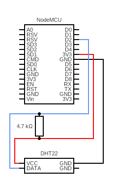

# NodeMCU + DHT22 (am2302) + ESPHome

A repository to store my [ESPHome](https://esphome.io/) configuration and circuit for a NodeMCU connected with [DHT22](https://cdn-shop.adafruit.com/datasheets/Digital+humidity+and+temperature+sensor+AM2302.pdf) temperature and humidity sensor.

Diagram created with <https://www.circuit-diagram.org/editor/>
